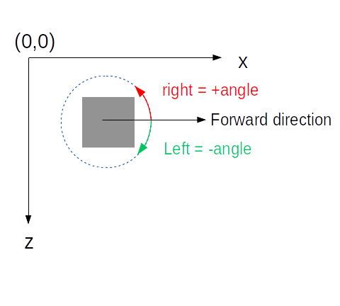
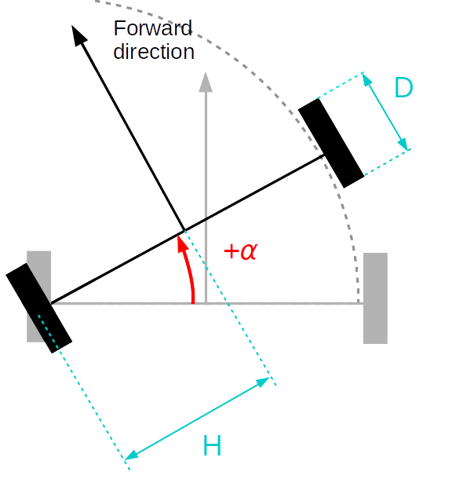
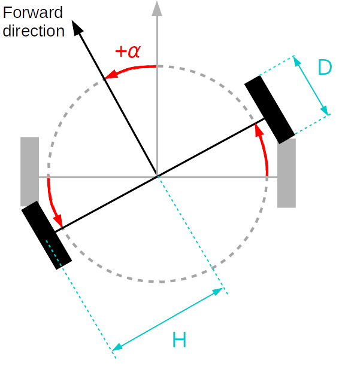

# A few note on the simulation

**Note:** there are a few useful macros [here](../tests/commons.inc).

The bot itself is about 4x4. It may not go outside the map since the simulator checks for collisions.
The interpreter assume that `OUT_B` is the left motor and `OUT_C` the right one.

The constants may be adjusted before compilation in [`src/Robot/Constants.h`](../src/Robot/Constants.h)

# The map

This is the orientation of the axes and the default robot orientation:



The default map loaded by the interpreter looks like this

```
25;25 12;12
* * * * * * * * * * * * * * * * * * * * * * * * *
* o o o o o o o o o o o o o o o o o o o o o o o *
* o o o o o o o o o o o o o o o o o o o o o o o *
* o o o o o o o o o o o o o o o o o o o o o o o *
* o o o o o o o o o o o o o o o o o o o o o o o *
* o o o o o o o o o o o o o o o o o o o o o o o *
* o o o o o o o o o o o o o o o o o o o o o o o *
* o o o o o o o o o o o o o o o o o o o o o o o *
* o o o o o o o o o o o o o o o o o o o o o o o *
* o o o o o o o o o o o o o o o o o o o o o o o *
* o o o o o o o o o o o o o o o o o o o o o o o *
* o o o o o o o o o o o o o o o o o o o o o o o *
* o o o o o o o o o o o o o o o o o o o o o o o *
* o o o o o o o o o o o o o o o o o o o o o o o *
* o o o o o o o o o o o o o o o o o o o o o o o *
* o o o o o o o o o o o o o o o o o o o o o o o *
* o o o o o o o o o o o o o o o o o o o o o o o *
* o o o o o o o o o o o o o o o o o o o o o o o *
* o o o o o o o o o o o o o o o o o o o o o o o *
* o o o o o o o o o o o o o o o o o o o o o o o *
* o o o o o o o o o o o o o o o o o o o o o o o *
* o o o o o o o o o o o o o o o o o o o o o o o *
* o o o o o o o o o o o o o o o o o o o o o o o *
* o o o o o o o o o o o o o o o o o o o o o o o *
* * * * * * * * * * * * * * * * * * * * * * * * *
```

The map is given with the orientation given about (so the `0,0` cell is on the left top corner, the `24,24` cell the right bottom corner)

Walls are marked by `*` while `o` are white cells (you can put "black" cells with `x` if you want to play with the light sensor).
On the top of the file, two sets of number indicates the size of the map (here its 25x25 distances units) and then the initial position of the robot (note that it lands on the center of the `5,5` case, so its actual position is `12.5,12.5`, as reported by the debug [`-g`] output).
The code checks of course that the dimensions matches the actual map, and that the robot does not hit a wall while landing (otherwise, the interpreter will report the issue).

You can use your own map, following the same format, using the `-m path/to/file.map` option. There is an example of map [there](../tests/testmap.map).

## Moving

**Note:** you can track the movement of the robot during time with `-c file.csv`, which will output a 4 column CSV: `time, x, z, angle`.

Moving the bot forward is basically (see [there](../tests/simple.nbc)):

```c
OnFwd(OUT_BC,80) // p = 80
wait 1000 // t = 1s
```

The following formula help to compute the distance. This is the formula giving you the speed, *v*, of the robot, depending on the power, *p* (which should technically be between -100 and 100):


where *f* is the power to speed ratio (20 is the current code) and *D* is the diameter of a wheel (0.358 in the current code).

And therefore,


gives you the time (in second) required to move by *x* unit of distance at the given power.


## Turning

Turning is a bit tricky. 

## First option

Here, I'm assuming that what you want is a rotation around a wheel:



You can achieve that by only turning one wheel:

```c
OnFwd(OUT_B,80) // turning left wheel make the robot turn right
wait 257
Off(OUT_B)
```

Here, time, *t*, is the key ingredient to arrive to the right angle, *α* (given in degree). It is given by the following formula : 


 
where *H* is the half width of the robot (currently 0.4085).
Sadly, due to the precision of the hardware and the values, the angle is not exactly what you expect. 

Another way is to set an expected rotation of the wheel and wait for the wheel to actually get to that point.
That can be achieved with the `RotateMotor()` macro (see [there](../tests/simpleturn.nbc)):

```
RotateMotorEx(OUT_B, 80, 410)
```

Of course, the wheel rotation  (in degree) does not correspond to the robot rotation, *α*. Again, there is a formula, being 


 
This way seems a little bit more precise (in fact, it adjusts the value by doing a few control and error cycles).


### Second option

Here, I'm assuming that what you are looking for is actually a rotation where the center (the position of the robot) does not actually change:


 
One way to do it is to give a reverse power value to both motors (see [there](../tests/simpleturn2.nbc)):

```c
OnFwd(OUT_B,20) // p=20
OnFwd(OUT_C,-20) // works as well with `OnRev(OUT_C,20)`
wait 513 // t=0.513 s
```

By setting the left motor forward and right motor backward, one turn right (so the rotation angle gets negative).

Again, there is the `wait` option, which requires to compute time:


But the same remark concerning the time precision apply.

Another way can be achieved with the `RotateMotorEx()` macro (see [there](../tests/simpleturn2.nbc)):

```
RotateMotorEx(
    OUT_BC, 
    80,   /* output power */
    205,  /* wheel rotation */ 
    -100, /* -100 for a right rotation, +100 for left */ 
    1,    /* should the two motor be synchronyzed ? Yes */ 
    1     /* should the motor brake at the end ? Yes */)
```

Again, there is a formula, being 


